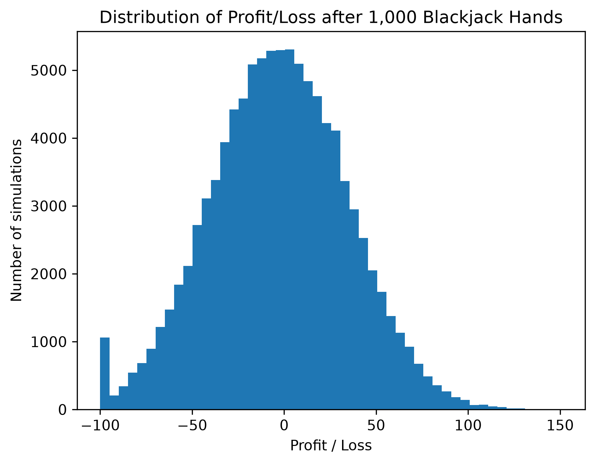

# Blackjack Strategy Simulator and Game

Two Python projects, one that lets the user play a game of blackjack, the other providing insights on a basic strategy decision table.

# Blackjack Strategy Simulator

The project models a player's decisions, hitting, standing, doubling, or splitting, all in accordance to a predifined basic strategy lookup table. Variations on hand length and number of simulations are conducted, providing insight into the resulting profit and loss. 

## Rules of this game

- Six deck shoe
- Cut card is one deck deep
- Dealer stands on 17
- DAS is allowed
- When aces are split, they hit and then stand, no resplitting or doubling allowed
- Resplits are allowed (apart from aces)
- Initial bankroll is 100
- Bet size is 1 (doubling and splitting result in 1 being added to the bet)
- Blackjack pays 3:2
- No surrender

## Mathematical background

 The simulation uses a large number of random trials via having a new randomly shuffled shoe.

 By running a large number of these games, the model can estimate multiple different quantities including average profit, probability of winning, risk of bust. This is an example of Monte Carlo simulation.

 ## Results
 
 From running the project, here is a collection of results:

 ### Simulation of 100,000 hands of length 1000
 
 

 After this simulation, the above histogram shows the profit attained after 1000 turns, and more detailed statistics are below (4sf):

| Statistic             |  Results|  |  |
| --------------------- | ------: |------:|------:|
| Simulations           | 100,000 | 1,000 | 1,000 |
| Hands per simulation  | 1,000 | 1,000 | 100 |
| Starting bankroll     | 100 | 100 | 100 |
| Mean profit           | -2.921 | -3.401 | -0.029 |
| Median profit         | -3.000 | -3.500 | 0.000 |
| Standard deviation    | 37.31 | 37.59 | 11.90 |
| Probability of profit | 46.62% | 46.01% | 49.00% |
| Probability of loss   | 52.84% | 53.55% | 51.00% |
| Probability of bust   | 0.446% | 0.440% | 0% |
| Best profit           | 151 | 149.5 | 35.5 |
| Worst profit          | -100 | -100 | -41 |

# Blackjack Game

This game is set up with the same rules that govern the simulation, but the code itself is different due to allowing human input rather than being fully self contained.

## Features
- Start with a bankroll of 100 with a fixed bet size of 1
- Ability to hit, stand, double and split
- Can choose to see basic strategy recommendation

# Future Goals

I wish to also add a separate simulation with a Hi-Lo card counting system in place, with the option for choosing which variations to play, yet this would need far more research of my own into card counting. This could lead into comparisons of Hi-Lo against basic strategy.

This could also be integrated into the game, which could also help recommend betsize before each hand.
